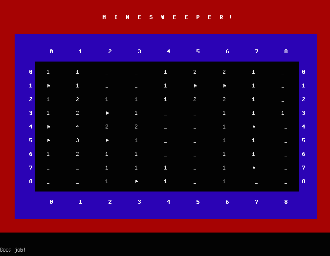

# Minesweeper!
Play the classic game right in the terminal

+ Download the directory 
+ run **bundle install**
+ run **ruby minesweeper.rb** right in the terminal to play!

Good Luck!

##Screenshots

####New Game!

####Auto Clearing 

####Lose Screen

####Win Screen
 { width: 200px; }